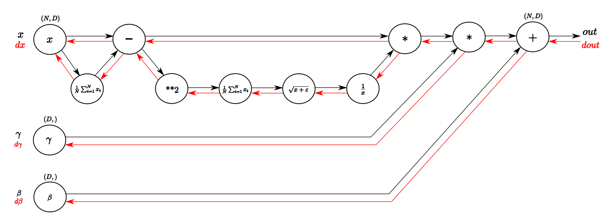

# Undestanding the backward pass through Batch Normalization Layer

> 原文链接：https://kratzert.github.io/2016/02/12/understanding-the-gradient-flow-through-the-batch-normalization-layer.html

# Batch Normalization

One Topic, which kept me quite busy for some time was the implementation of [Batch Normalization](http://arxiv.org/abs/1502.03167), especially the backward pass. 
Batch Normalization is a technique to provide any layer in a Neural Network with inputs that are zero mean/unit variance - and this is basically what they like! 
But BatchNorm consists of one more step which makes this algorithm really powerful. Let’s take a look at the BatchNorm Algorithm:

> **Input**: Values of $\large x$ over a mini-batch: $\large B = \{ x_1, x_2, \dots, x_m \} $;  
>            Parameters to be learned: $\large \gamma, \beta$ 
> 
> **Output**: $\large {y_i = BN_{\gamma, \beta}(x_i)}$
> 
> $\Large \mu_B \leftarrow \frac{1}{m} \sum_{i=1}^{m} x_i$ // mini=batch mean
> 
> $\Large \sigma_B^2 \leftarrow \frac{1}{m} \sum_{i=1}^{m} (x_i - \mu_B)^2$ // mini-batch variance
> 
> $\Large \hat{x_i} \leftarrow \frac{x_i - \mu_B}{\sqrt{\sigma_B^2 + \epsilon}}$ // normalize
> 
> $\Large y_i \leftarrow \gamma \hat{x_i} + \beta = BN_{\gamma, \beta}(x_i)$ // scale and shift

> Algorithm of Batch Normalization copied from the Paper by Ioffe and Szegedy mentioned above.

Look at the last line of the algorithm. After normalizing the input `x` the result is squashed through a linear function with parameters `gamma` and `beta`. 
These are learnable parameters of the BatchNorm Layer and make it basically possible to say “Hey!! I don’t want zero mean/unit variance input, give me back the raw input - it’s better for me.” 
If `gamma = sqrt(var(x))` and `beta = mean(x)`, the original activation is restored. This is, what makes BatchNorm really powerful. 
We initialize the BatchNorm Parameters to transform the input to zero mean/unit variance distributions but during training they can learn that any other distribution might be better. 
Anyway, I don’t want to spend to much time on explaining Batch Normalization. If you want to learn more about it, the [paper](http://arxiv.org/abs/1502.03167) is very well written and [here](https://youtu.be/gYpoJMlgyXA?list=PLkt2uSq6rBVctENoVBg1TpCC7OQi31AlC&t=3078) Andrej is explaining BatchNorm in class.

Btw: it’s called “Batch” Normalization because we perform this transformation and calculate the statistics only for a subpart (a batch) of the entire trainingsset.

## Backpropagation

In this blog post I don’t want to give a lecture in Backpropagation and Stochastic Gradient Descent (SGD). 
For now I will assume that whoever will read this post, has some basic understanding of these principles. 
For the rest, let me quote Wiki:

> Backpropagation, an abbreviation for “backward propagation of errors”, is a common method of training artificial neural networks used in conjunction with an optimization method such as gradient descent. 
> The method calculates the gradient of a loss function with respect to all the weights in the network. 
> The gradient is fed to the optimization method which in turn uses it to update the weights, in an attempt to minimize the loss function.

> 反向传播是“误差反向传播”的缩写，是训练人工神经网络的一种常见方法，与梯度下降等优化方法结合使用。该方法计算损失函数相对于网络中所有权重的梯度。
> 梯度被馈送到优化方法，优化方法进而使用它来更新权重，以尽量减少损失函数。

Uff, sounds tough, eh? I will maybe write another post about this topic but for now I want to focus on the concrete example of the backwardpass through the BatchNorm-Layer.

## Computational Graph of Batch Normalization Layer

I think one of the things I learned from the cs231n class that helped me most understanding backpropagation was the explanation through computational graphs. 
These Graphs are a good way to visualize the computational flow of fairly complex functions by small, piecewise differentiable subfunctions. 
For the BatchNorm-Layer it would look something like this:

> Computational graph of the BatchNorm-Layer. From left to right, following the black arrows flows the forward pass. 
> The inputs are a matrix X and gamma and beta as vectors. From right to left, following the red arrows flows the 
> backward pass which distributes the gradient from above layer to gamma and beta and all the way back to the input.

